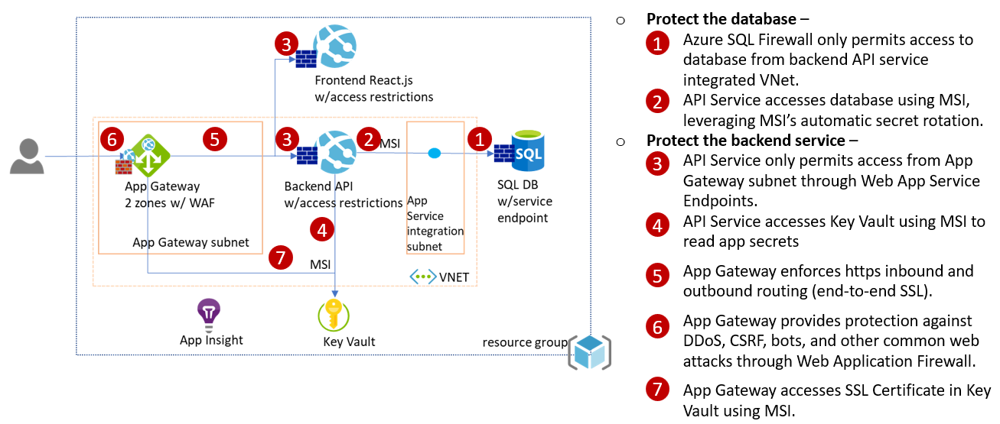
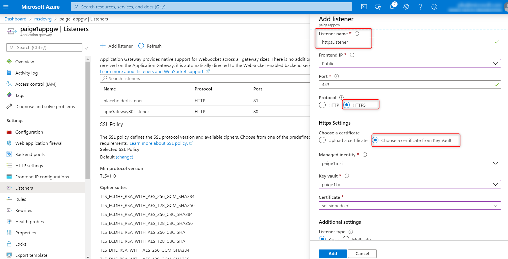
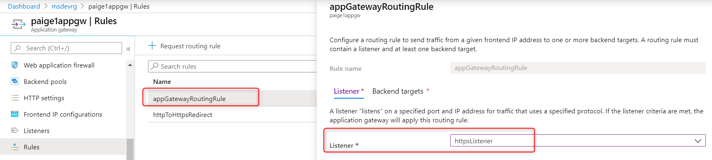
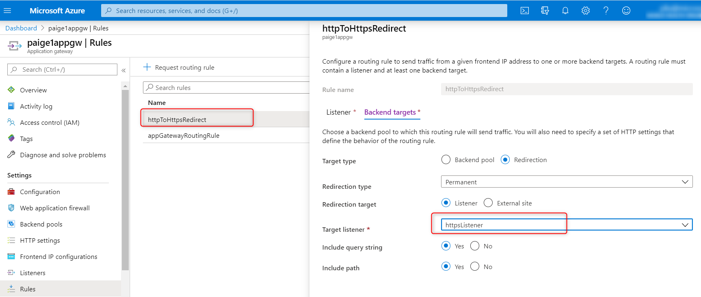
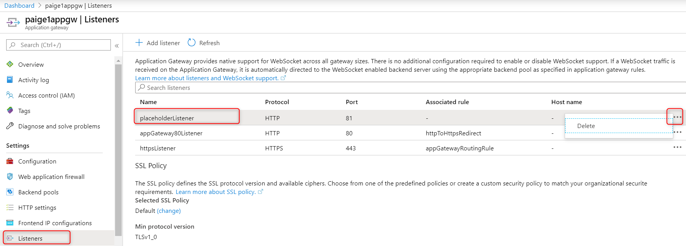

# ARM template that deploys the infrastructure to secure a web site on Azure

## What is deployed?
An Azure DevOps deployment pipeline defined in [pipeline.yaml](pipeline.yaml) calls the [Azure Resource Manager (ARM) template](azuredeploy.json) to deploy a web site secured as following: 



Note:
> 1. This pipeline deploys a frontend Web App running a Nginx docker image and a backend Web App running a default ASP.NET Core 3.1 application.  The pipeline has no knowledge of any specific app.  Everytime the pipeline runs, it will revert the apps to this initial state.  You need to run your CI/CD pipelines for your apps to redeploy the apps.
> 2. This pipeline doesn't provision a SQL database, Key Vault, or Azure Container Registry.  These components store your data and you need to create them yourself.  Running the pipelines multiple times will not alter the data stored in these components.  
>    * This pipeline does deploy an Azure SQL Server on which you can create your own database.
> 3. Application Gateway is deployed in [2 zones](https://docs.microsoft.com/en-us/azure/application-gateway/application-gateway-autoscaling-zone-redundant). Not all Azure regions support App Gateway multi-zone deployment. If the region you are deploying to doesn't support multi-zone, modify the ARM template to use single zone.

## How is it secured?
The ARM template implements the following security measures:
* [Azure SQL DB and Azure SQL Server firewalls](https://docs.microsoft.com/en-us/azure/sql-database/sql-database-firewall-configure) are configured to only allow the Web API [outbound IPs](https://docs.microsoft.com/en-us/azure/app-service/overview-inbound-outbound-ips#find-outbound-ips) to access the database.
* Azure Web App accesses SQL DB using [Managed Identity](https://docs.microsoft.com/en-us/azure/active-directory/managed-identities-azure-resources/overview) (MSI).
* [Azure App Service endpoints](https://docs.microsoft.com/en-us/azure/app-service/app-service-ip-restrictions#service-endpoints) are configured to only allow Azure Application Gateway to access the Web API.
* Azure Application Gateway is configured for [end-to-end SSL](https://docs.microsoft.com/en-us/azure/application-gateway/end-to-end-ssl-portal) and [Web Application Firewall](https://docs.microsoft.com/en-us/azure/web-application-firewall/ag/ag-overview).
* Azure Application Gateway [retrieves SSL certificate from Key Vault](https://docs.microsoft.com/en-us/azure/application-gateway/configure-keyvault-ps) using MSI.

Alternative solutions considered - 
* [Azure Front Door](https://docs.microsoft.com/en-us/azure/frontdoor/front-door-overview) - can load balance across regions while Application Gateway can only load balance within a region. If there's no need for cross-region routing, Application Gateway has one IP address that can be used to lock down App Service. Front Door has a much wider range of outbound IP addresses. 
* [Azure SQL DB VNet Service Endpoints](https://docs.microsoft.com/en-us/azure/sql-database/sql-database-vnet-service-endpoint-rule-overview?toc=/azure/virtual-network/toc.json) - restricts access to SQL from only a virtual network (VNET). Combined with [Azure App Service VNet Integration](https://docs.microsoft.com/en-us/azure/app-service/web-sites-integrate-with-vnet), it’s possible to restrict SQL Server to be only accessible from App Service.  It's not implemented in this sample because this feature is in preview for Linux App Service (May 2020). Also note that
    * this feature is only supported on Premium V2 App Service Plan
    * you need to run "DBCC FLUSHAUTHCACHE" to clear the cache of firewall on SQL
* [Azure App Service Private Endpoints](https://docs.microsoft.com/en-us/azure/app-service/networking/private-endpoint) - restricts access to App Service from only a VNet. However this is currently (Apr 2020) in Preview only in 2 regions. 
* [Azure App Service Environment](https://docs.microsoft.com/en-us/azure/app-service/environment/intro) - places App Service in a VNet. This is a dedicated App Service SKU which could be an overkill for some websites.

## How to deploy an environment from scratch

> The steps below describe how to provision a single environment. Steps to provision other environments, such as dev/test/staging/production, are exactly same. You just need to create another variable group in Azure DevOps, and [point the pipeline at that variable group](pipeline.yaml#L11).

1. Create a Service Connection in Azure DevOps (AzDO) to your Azure subscription.  You must have ```Owner``` or ```User Access Administrator``` permissions on the subscription to perform this.
2. Create a resource group in Azure.  All resources will be deployed in the same region as the resource group.
3. Create a AzDO Variable Group ```dev-infra-vg``` and add the following variables:
    * ```AZURE_RM_SVC_CONNECTION``` - name of the service connection created above
    * ```RESOURCE_GROUP``` - name of the resource group created above
    * ```TAG``` - a unique name that identifies this deployment in this resource group, use only alphabet and numbers
    * ```WEBAPPNAME``` - the web site will be accessible from ```https://WEBAPPNAME.your_resourcegroup_location.cloudapp.azure.com```
    * ```DATABASE_PASSWORD``` - the password for Azure SQL Server
4. Run the pipeline defined by [pipeline.yaml](pipeline.yaml). 

### Post deployment manual steps ###
Other than the DATABASE_PASSWORD required to provision Azure SQL, there's no secret stored in the pipeline. Post deployment, follow the instructions below to perform a few privileged operations manually.  The following steps require privileged permissions to access Key Vault, SQL DB, and Azure Container Registry.  Run the following commands in an Azure Cloud Shell unless otherwise specified.

**Step 1. Add a SSL certificate to Azure Key Vault, and grant access to a managed identity**

1. A managed identity is provisioned for you during the pipeline run. Go to your resource group to find its object id. Run the following command to grant read access to the managed identity. Replace ```$KEYVAULTNAME```, ```$RESOURCE_GROUP``` with your own.

```bash
az keyvault set-policy -n $KEYVAULTNAME -g $RESOURCE_GROUP --object-id $MANAGEDIDENTITY_OBJECTID --certificate-permissions get list --secret-permissions get
```

2. Add a SSL certificate to your own Azure Key Vault, create a Key Vault if needed. The following command creates a self-signed certificate in Key Vault.  ```$MY_ACCOUNTNAME``` is typically your email address, or if you are a guest user of this AAD Tenant, then it's ```alias_company#EXT#@contoso.onmicrosoft.com```, for example, ```paige_microsoft.com#EXT#@contoso.onmicrosoft.com```.

```bash
# give yourself access policy to create certificate if needed
az ad user show --id $MY_ACCOUNTNAME # get object id to use below
az keyvault set-policy -n $KEYVAULTNAME -g $RESOURCE_GROUP --object-id $MY_OBJECTID --certificate-permissions create get list --secret-permissions get
# create a self-signed cert
az keyvault certificate create --vault-name $KEYVAULTNAME -n $CERTNAME -p "$(az keyvault certificate get-default-policy)"
```

**Step 2. Provide the SSL certificate to App Gateway**  
These changes are needed because when the environment is provisioned we don't have the final SSL certificate. App Gateway cannot create https listener without a certificate. 

1. Add ```httpsListener``` to App Gateway by specifying https and pull the certificate from Key Vault using the managed identity:

2. Replace the ```placeholderListener``` of ```AppGatewayRoutingRule``` with ```httpsListener```.  Wait until update finishes:

3. Update ```httpToHttpsRedirect``` rule to ```httpsListener```:

4. delete the ```placeholderListener```


**Step 3. Grant backend web app access to Azure SQL**
1. Make yourself AAD admin of SQL Server
2. Add your client IP to the firewall rule of SQL Server
3. Go to Azure portal, navigate to your Azure SQL DB, log in as AAD admin.  In the Query editor, run the following TSQL query to grant backend web app access to your SQL database. Replace ```WEBAPPNAME``` with the value you specified in your AzDO variable group. **Note** if you re-create a web app with the same name, the managed identity of the new web app is not the same as the deleted web app. Run the ```DROP``` command below first.

```sql
-- DROP USER [WEBAPPNAME-backend] -- removes previous webapp of same name
CREATE USER [WEBAPPNAME-backend] FROM EXTERNAL PROVIDER
ALTER ROLE db_datareader ADD MEMBER [WEBAPPNAME-backend] -- gives permission to read to database
ALTER ROLE db_datawriter ADD MEMBER [WEBAPPNAME-backend] -- gives permission to write to database
```

**Step 4. Grant backend web access to KeyVault secrets**

Replace ```$KEYVAULTNAME```, ```$RESOURCE_GROUP```, and  ```$WEBAPPNAME``` with your own.

```bash
WEBAPPSP=$(az webapp show -n $WEBAPPNAME-backend -g $RESOURCE_GROUP --query "identity.principalId" -o tsv)
az keyvault set-policy -n $KEYVAULTNAME -g $RESOURCE_GROUP --object-id $WEBAPPSP --secret-permissions get list
```

**Step 5. Grant frontend web app access to Azure Container Registry**
The frontend web app runs in a container on App Service.  This step is necessary to grant the frontend web app access to Azure Container Registry (ACR) if that's where the container image is built. 


## Troubleshooting

### Backend Web App Functionality with App Gateway
The App Gateway is deployed with two backend pools, one for the frontend web application and another for the backend web application. Routing traffic to these two pools are determind by the URL path, all paths that fall under `https://appgatewayhostname/api/*` will be routed to the backend web application. For example, `https://appgatewayhostname/api/` will route to `https://backendwebapp/api/`, and `https://appgatewayhostname/api/requests/` will route to `https://backendwebapp/api/requests`.

In order for this routing to work, the root endpoint (`https://backendwebapp/`) of the backend web app must be implemented for the default health probe to work, or you can implement a custom health probe in App Gateway. If the health probe for the backend pool on the app gateway fails, all routes to the backend web app will result in a 502 error.

The frontend and backend web apps can only be accessed through the App Gateway.  If you need direct access to the web apps for troubleshooting, you can delete the access restrictions on the web apps, and add them back when you are done.

### Setup the Subscription to allow use of Managed Identity.
Your deployment will fail if your Azure subscription doesn't have the managed identity provider registered.  You must be the 'Owner' of the subscription to perform this. Run the following in Azure Cloud Shell:

```bash
az provider register -n Microsoft.ManagedIdentity
```

### Proper sizing of the App Service Plan
The App Service Plan runs both frontend and backend web sites.  This sample is using the ```P2V2``` SKU which has 7GB memory.  Monitor the CPU and memory usage of the App Service to properly size it. 

### Proper sizing of the Database
The Database is currently configured as General Purpose Gen4 with 2 vCores and 64GB.  As your web site grows, this might need to be resized as well. 